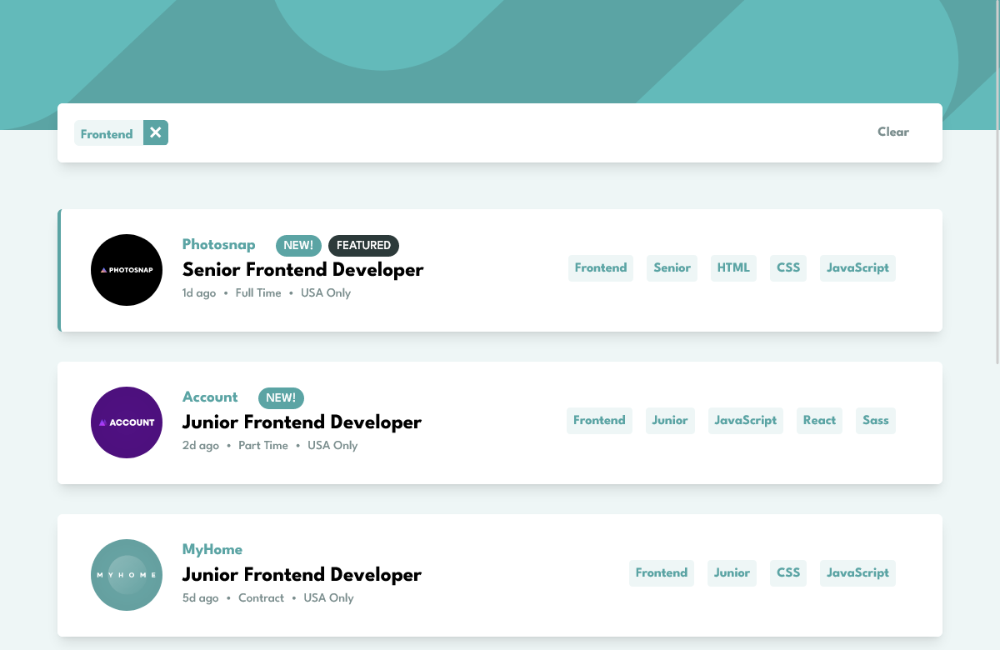

# Frontend Mentor - Job listings with filtering solution

This is a solution to the [Job listings with filtering challenge on Frontend Mentor](https://www.frontendmentor.io/challenges/job-listings-with-filtering-ivstIPCt). Frontend Mentor challenges help you improve your coding skills by building realistic projects.

## Table of contents

- [Overview](#overview)
  - [The challenge](#the-challenge)
  - [Screenshot](#screenshot)
  - [Links](#links)
- [My process](#my-process)
  - [Built with](#built-with)
  - [What I learned](#what-i-learned)
  - [Continued development](#continued-development)
- [Author](#author)

**Note: Delete this note and update the table of contents based on what sections you keep.**

## Overview

### The challenge

Users should be able to:

- View the optimal layout for the site depending on their device's screen size
- See hover states for all interactive elements on the page
- Filter job listings based on the categories

### Screenshot

### Links

- Solution URL: [Github repo](https://github.com/king-oldmate/FDM-job-listing-with-filter)
- Live Site URL: [Add live site URL here](https://your-live-site-url.com)

## My process

### Built with

- Semantic HTML5 markup
- CSS custom properties (what does this really mean? Does it apply to tailwind?)
- Flexbox
- Mobile-first workflow
- [React](https://reactjs.org/) - JS library
- [TailwindCSS](https://tailwindcss.com) - Utility first CSS framework

### What I learned

It's not so much that I learned something specifically, but I have this great feeling of accomplishment since it feels like working with React really clicked with me today. `useState`, `useEffect`, and props all made a lot more sense and once I had the general layout done it didn't take me long to work out how to filter jobs based upon selected tags.

On that note, I suppose the main challenge I overcame was working with different array methods to get that part completed.

### Continued development

I would like to try and add:

- [ ] a backend with REST API
- [ ] user/employer login
- [ ] job submission form
- [ ] job application form

## Author

- Frontend Mentor - [@king-oldmate](https://www.frontendmentor.io/profile/king-oldmate)
